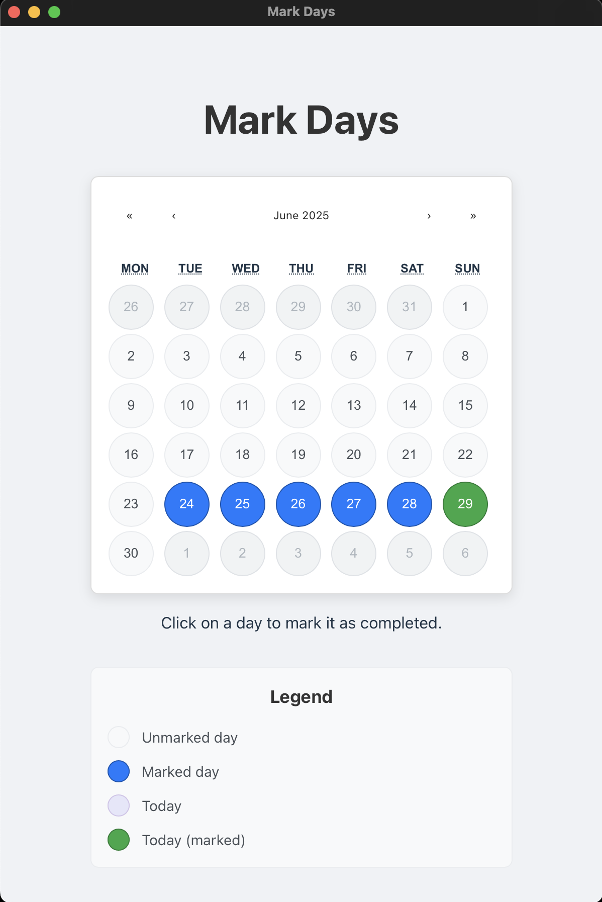

# Mark Days - Daily Activity Tracker

A simple and lightweight desktop application for macOS to help you track your daily activities and habits.



## Features

*   **Simple Calendar View**: Displays a clear monthly calendar.
*   **Easy Marking**: Simply click on a day to mark it as completed. Click again to unmark it.
*   **Data Persistence**: Your marked days are saved automatically on your computer, so your data is safe between sessions.
*   **Flexible Usage**: Perfect for tracking medication, exercise, habits, or any daily activity you want to monitor.

## Data Storage

The application stores your tracking data locally on your computer in a JSON file. The data is automatically saved when you mark or unmark days.

**Storage Location (macOS):**
```
~/Library/Application Support/com.markdays.tracker/markdays.json
```

You can view your stored data by navigating to this location in Finder (press `Cmd + Shift + G` and paste the path) or by using Terminal:
```bash
cat ~/Library/Application\ Support/com.markdays.tracker/markdays.json
```

The file contains your marked days in JSON format, ensuring your data persists between app sessions.

## Technology Stack

*   **Frontend**: [React](https://react.dev/) with [TypeScript](https://www.typescriptlang.org/)
*   **Build Tool**: [Vite](https://vitejs.dev/)
*   **Desktop Framework**: [Tauri](https://tauri.app/) (v2)

## Project Setup

### Prerequisites

Before you begin, ensure you have the necessary system dependencies installed for Tauri. You can find the detailed instructions for macOS on the [official Tauri website](https://tauri.app/v2/guides/getting-started/prerequisites).

Essentially, you will need:
*   [Node.js](https://nodejs.org/) (which includes `npm`)
*   [Rust](https://www.rust-lang.org/tools/install)

### Installation

1.  **Clone the repository (if applicable):**
    If this project were on GitHub, you would clone it. For now, just navigate to the project directory.

2.  **Install NPM dependencies:**
    This command installs all the necessary frontend libraries, such as React and `react-calendar`.
    ```bash
    npm install
    ```

## How to Run the Application in dev mode

To run the application in development mode, execute the following command in your terminal. This will start the Vite development server and launch the native Tauri window. The app will automatically reload if you make any changes to the source code.

```bash
npm run tauri dev
```

## How to Build the Application

To create a standalone, distributable version of the application, run the build command:

```bash
npm run tauri build
```

This process will compile the frontend, build the Rust backend, and bundle everything into a native macOS application.

### Build Output Locations

The build process creates several output formats:

**macOS App Bundle (Ready to run):**
```
src-tauri/target/release/bundle/macos/markdays.app/
```

**DMG Installer (For distribution):**
```
src-tauri/target/release/bundle/dmg/markdays_0.1.0_aarch64.dmg
```

### How to Run the Compiled App

You have several options to run the built application:

**Option 1: Run the App Bundle Directly**
```bash
open src-tauri/target/release/bundle/macos/markdays.app
```

**Option 2: Install from DMG**
1. Double-click the DMG file: `src-tauri/target/release/bundle/dmg/markdays_0.1.0_aarch64.dmg`
2. Drag the Mark Days app to your Applications folder
3. Launch from Applications or Spotlight

**Option 3: Run from Terminal**
```bash
./src-tauri/target/release/bundle/macos/markdays.app/Contents/MacOS/markdays
```

### Distribution

- **For personal use**: Use the `.app` bundle directly
- **For sharing/distribution**: Use the `.dmg` file - it provides a standard macOS installation experience that others can download and install 